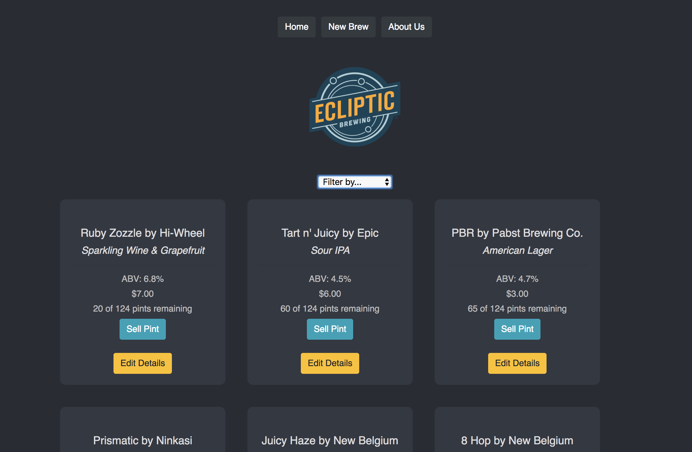
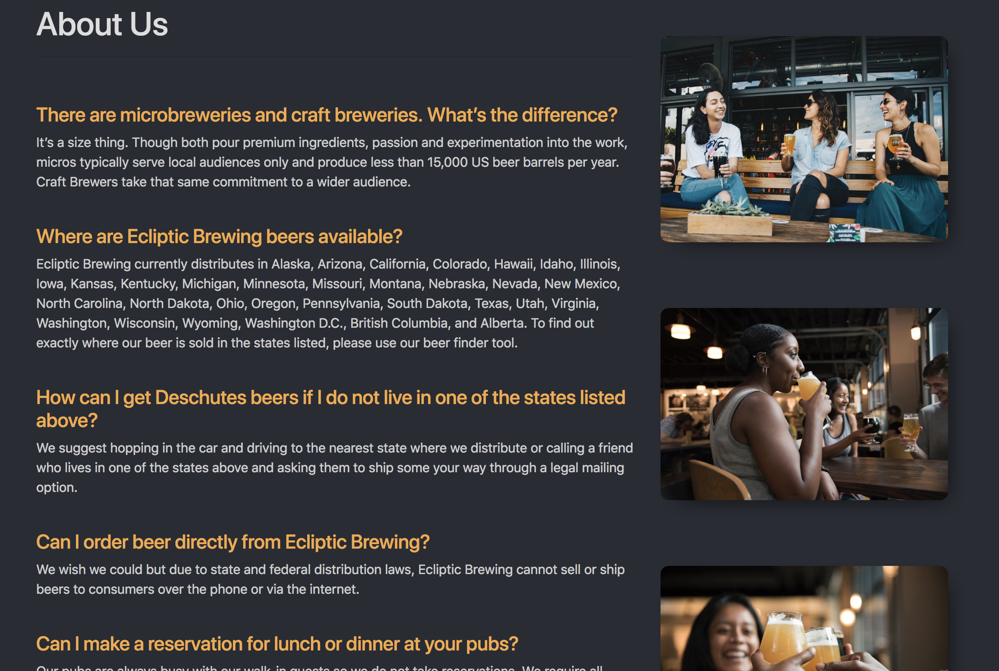

# Tap Room | React Edition
### Refactoring an Angular application into React
#### _Nikki Boyd | September 7, 2018_
#### _React Independent Project | Week 1_

# _About the App_
This application showcases my foundational knowledge of React after week one. This project gave me experience setting up a work environment (including Babel transpiling, Webpack module bundling, a development server with hot module replacement, and linting), building out UI components, styling with React's unique inline CSS styles, and iterating through JSON data.

Below is a screenshot of the project after phase one:

# _Specifications_
This component tree illustrates the relationship between components and the unidirectional flow of data throughout the application (aside from the EditDetails component, which is a feature currently in development). The stateful app component passes down its state and methods to the NewBrewControl component, so that user input can be saved to the MasterBrewList. I've also refactored the NewBrewControl component to become stateful. It passes down state to the determine whether or not the form is ready for the user to received. The user changes the state of the component by agreeing to the conditions, which triggers the form for creating a new brew entry to appear. Since this was a bonus feature, I did not have time to include it in my original component tree.

# _Installation for OSX_
- Download the repository from GitHub (https://github.com/nikkiboyd/React-Tap-Room)
- `npm install` to install all necessary packages included in the webpack.config.js file
- `npm start` to compile and run the application with webpack
- Open any web browser and navigate to http://localhost:8080/ on your local machine.

# _Technologies_
- React
- Javascript ES6
- Webpack
- ESlint
- Babel
- Bootstrap
- HTML
- CSS

# _Contact_
Please email Nikki Boyd at boyd.nikki@icloud.com with any questions.

# _License_
This software is licensed under the MIT license.

Copyright (c) 2018 Nikki Boyd
