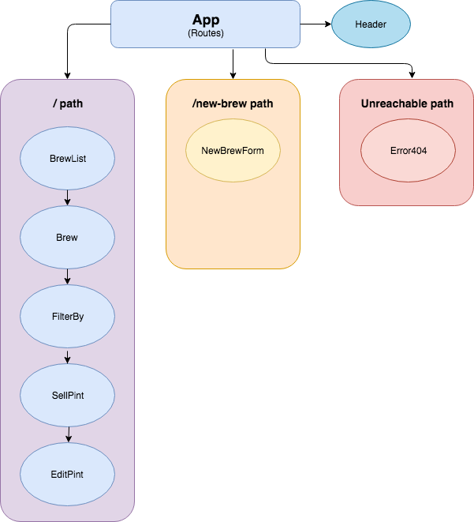

# Tap Room | React Edition
### Refactoring an Angular application into React
#### _Nikki Boyd | September 7, 2018_
#### _React Independent Project | Week 1_

# _About the App_
This application showcases my foundational knowledge of React after week one. This project gave me experience setting up a work environment (including Babel transpiling, Webpack module bundling, a development server with hot module replacement, and linting), building out UI components, styling with React's unique inline CSS styles, and iterating through JSON data.

Below is a screenshot of the project after phase one:

# _Specifications_

# _Installation for OSX_
- Download the repository from GitHub (https://github.com/nikkiboyd/React-Tap-Room)
- `npm install` to install all necessary packages included in the webpack.config.js file
- `npm start` to compile and run the application with webpack
- Open any web browser and navigate to http://localhost:8080/ on your local machine.

# _Technologies_
- React
- Javascript ES6
- Webpack
- ESlint
- Babel
- Bootstrap
- HTML
- CSS

# _Contact_
Please email Nikki Boyd at boyd.nikki@icloud.com with any questions.

# _License_
This software is licensed under the MIT license.

Copyright (c) 2018 Nikki Boyd
